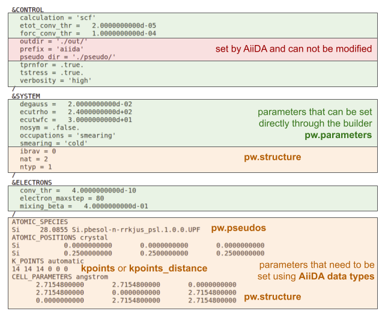
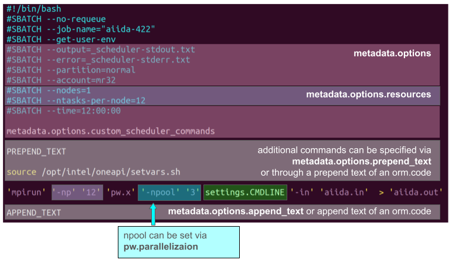

# Customizing the inputs of an aiida-quantumespresso workchain

## Interacting with the workchain builder

Workchain builder is a dictionary that specifies all the inputs of the workflow and all called calculations. It is the main object to interact with in order to change the default settings/parameters. Every workchain class includes `get_builder()` method to initialize an empty builder with the correct namespaces as well as `get_builder_from_protocol()` method returning a builder, prepopulated with default parameters defined in the simulation protocols ('fast', 'balanced' or 'stringent' as defined in https://arxiv.org/pdf/2504.03962).

To check the builder structure in the interactive shell use the following commands for the relevant WorkChain:

```python
from aiida_quantumespresso.workflows.pw.base import PwBaseWorkChain

builder = PwBaseWorkChain.get_builder()
builder
# -> builder inputs
```
or
```python
from aiida import orm
from aiida_quantumespresso.workflows.pw.base import PwBaseWorkChain

from ase.build import bulk

builder = PwBaseWorkChain.get_builder_from_protocol(
    code = orm.load_code('pw@localhost'),
    structure = orm.StructureData(ase=bulk('Si', 'fcc', 5.43)),
    protocol='balanced'
)
builder
# -> builder inputs
```
Note that `get_builder_from_protocol()` requires structure and code arguments.

After providing the necessary information (see explanations below), the builder object is passed to `run()` or `submit()` methods of `aiida.engine` in order to perform the calculation.

```python
from aiida.engine import submit

wkchain = submit(builder)
print(f"Submitted workchain with pk {wkchain.pk}!")
```

## Customizing the pw.x input file

Most of the input parameters can be customized directly through the builder. However, some inputs such as structure, pseudopotentials and k-points have to be provided using AiiDA-specific data types (see more detailed explanation below). Moreover, a few parameters such as the directory names for output and pseudopotentials as well as prefix are set by AiiDA and can not be modified.



For example, cutoff parameters can be adjusted by modifying the builder dictionary:

```python
from aiida import orm
from aiida_quantumespresso.workflows.pw.base import PwBaseWorkChain

from ase.build import bulk

builder = PwBaseWorkChain.get_builder_from_protocol(
    code = orm.load_code('pw@localhost'),
    structure = orm.StructureData(ase=bulk('Si', 'fcc', 5.43)),
    protocol='balanced'
)

builder.pw.parameters["SYSTEM"]["ecutrho"] = 300.0
builder.pw.parameters["SYSTEM"]["ecutwfc"] = 40.0
```

### Inputs provided through AiiDA data types

**Crystal structure** needs to be provided using AiiDA StructureData. More information on the relevant [documentation page](https://aiida.readthedocs.io/projects/aiida-core/en/stable/topics/data_types.html#topics-data-types-materials-structure).

**Pseudopotentials**

Pseudopotentials are provided as [UpfData](https://aiida.readthedocs.io/projects/aiida-core/en/stable/topics/data_types.html#upfdata) data type. Usually they would be installed as part of the pseudopotential family via [aiida-pseudo](https://github.com/aiidateam/aiida-pseudo) package. As explained in [the package documentation](https://aiida-pseudo.readthedocs.io/en/latest/), pseudopotential families can be installed via a command line interface, either from the provided libraries ([SSSP](https://www.materialscloud.org/discover/sssp/table/efficiency) and [PseudoDojo](http://www.pseudo-dojo.org/)) or by importing from a custom archive or folder.

- By default, AiiDA-QuantumESPRESSO workchains are using pseudopotentials from SSSP v1.3 Efficiency

- To use a different pseudopotential family installed via AiiDA-Pseudo, pass the requred label with the `pseudo_family` keyword of `get_builder_from_protocol()`:

```python
from aiida import orm
from aiida_quantumespresso.workflows.pw.base import PwBaseWorkChain

from ase.build import bulk

builder = PwBaseWorkChain.get_builder_from_protocol(
    code = orm.load_code('pw@localhost'),
    structure = orm.StructureData(ase=bulk('Si', 'fcc', 5.43)),
    pseudo_family = "PseudoDojo/0.4/PBEsol/SR/standard/upf"
)
```

#TODO:

- how to change cutoffs
- setting the pseudos via family.get_pseudos https://github.com/mikibonacci/tutorials-aiida-yambo/blob/main/prerequisites/0_2_QE_starting_point.ipynb 

**K-points** are specified through [KpointsData](https://aiida.readthedocs.io/projects/aiida-core/en/stable/topics/data_types.html#kpointsdata) that supports k-point meshes as well as custom k-point lists, and also features symmetry-based automatic calculation of k-point paths for electronic band structure calculation.

Refer to the [**Builder structures**](#builder-structures-of-aiida-quantumespresso-workflows) section to see where to specify these inputs in the builder dictionary depending on the WorkChain you are using.

## Customizing the submission script

The submission script can also be customized mainly through `metadata.options` namespace of the builder.



For example, when running `PwBaseWorkChain`

```python
from aiida import orm
from aiida_quantumespresso.workflows.pw.base import PwBaseWorkChain

from ase.build import bulk

builder = PwBaseWorkChain.get_builder_from_protocol(
    code = orm.load_code('pw@localhost'),
    structure = orm.StructureData(ase=bulk('Si', 'fcc', 5.43)),
    protocol='balanced'
)

builder.metadata["options"]["queue_name"] = "normal" # to specify partition
builder.metadata["options"]["resources"]["num_machines"] = 1
builder.metadata["options"]["resources"]["tot_num_mpiprocs"] = 12
```

Full list of metadata available can be found at [AiiDA documentation page](link to this section of the real-world tips and tricks)

## Overrides

If many default inputs need to be overwritten, it is convenient to use the `overrides` keyword, provided by `get_builder_from_protocol()` function of the required workchain.
It is necessary to arrange the custom parameters into a dictionary respecting the structure of the builder of the workchain.

```python
from aiida import orm
from aiida_quantumespresso.workflows.pw.base import PwBaseWorkChain

from ase.build import bulk

overrides = {
  "pw": {
    "parameters": {
      "SYSTEM": {
        "ecutrho": 300.0,
        "ecutwfc": 40.0
      }
    }
  },
  "metadata": {
    "options": {
      "queue_name": "normal",
      "resources": {
        "num_machines": 1,
        "tot_num_mpiprocs": 12
      }
    }
  }
}

builder = PwBaseWorkChain.get_builder_from_protocol(
    code = orm.load_code('pw@localhost'),
    structure = orm.StructureData(ase=bulk('Si', 'fcc', 5.43)),
    protocol='balanced'
)
```

## Accessing the simulation directory and all files

In order to go to the calculation folder and see all the files you can use the following command for a given calculation with pk `<pk>`:
```
verdi calcjob gotocomputer <pk>
```
In order to find the `<pk>` of the CalcJob, run 
```
verdi process status <workchain pk>
```
providing the `<pk>` number of the submitted WorkChain to see which calculations were started by the workflow.

Another way is to dump all the files from the workchain to a folder using
```
verdi process dump <pk>
```

That will create a folder in your current directory, and it will contain all the retrieved files of the calculation (including the inputs). This is particularly useful if you want to inspect the retrieved files of a failed calculation, or if you want to re-run the calculation locally or somewhere else for debugging.

## Builder structures of AiiDA-QuantumESPRESSO workflows

In order to actually change the inputs you need to modify the relevant fields of the builder dictionary. Further we explain the builder structures for the main workchains.

### PwBaseWorkChain

builder
- "clean_workdir": bool,
- "kpoints": KpointsData,
- "kpoints_distance": float,
- "kpoints_force_parity"
- "pw":
    - "parameters":
        - "CONTROL":
        - "SYSTEM":
        - etc.

### PwRelaxWorkChain
builder
- "base_init_relax":
  - "pw":
    - "parameters"
- "base_relax":
  - "pw":
    - "parameters"

### PwBandsWorkChain
builder
- "base_relax":
  - "pw":
    - "parameters"
- "relax":
  - "pw":
    - "parameters"
- "scf":
  - "pw":
    - "parameters"
- "bands"
  - "pw"
    - "parameters"