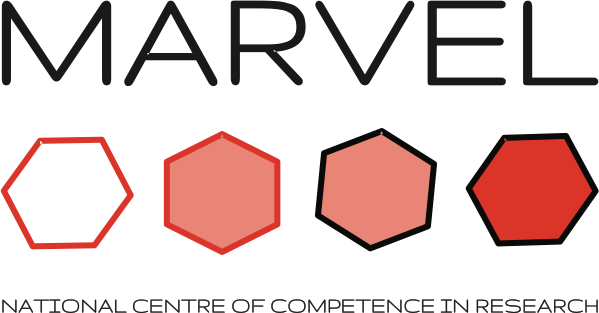

.. aiida documentation master file, created by
   sphinx-quickstart on Wed Oct 24 11:33:37 2012.
   You can adapt this file completely to your liking, but it should at least
   contain the root `toctree` directive.

#######################################
`AiiDA`_ plugin for `Quantum ESPRESSO`_
#######################################

.. figure:: images/AiiDA_transparent_logo.png
    :width: 250px
    :align: center
    :height: 60px

.. _AiiDA: http://www.aiida.net
.. _Quantum ESPRESSO: http://www.quantumespresso.org

Welcome to documentation of the AiiDA plugin for the Quantum ESPRESSO code!
===========================================================================

The plugin is available at http://github.com/aiidateam/aiida-quantumespresso

If you use this plugin and/or AiiDA for your research, please cite the following work:

.. highlights:: Giovanni Pizzi, Andrea Cepellotti, Riccardo Sabatini, Nicola Marzari,
  and Boris Kozinsky, *AiiDA: automated interactive infrastructure and database
  for computational science*, Comp. Mat. Sci 111, 218-230 (2016);
  http://dx.doi.org/10.1016/j.commatsci.2015.09.013; http://www.aiida.net.

User's guide
++++++++++++

.. toctree::
   :maxdepth: 4

   user_guide/index

Modules provided with aiida-quantumespresso (API reference)
+++++++++++++++++++++++++++++++++++++++++++++++++++++++++++

.. toctree::
   :maxdepth: 4

   module_guide/index

Developer's guide
+++++++++++++++++

.. toctree::
   :maxdepth: 4

   devel_guide/index

Indices and tables
==================

* :ref:`genindex`
* :ref:`modindex`
* :ref:`search`

Acknowledgements
++++++++++++++++
We acknowledge support from the `NCCR MARVEL`_ funded by the Swiss National Science Foundation and the EU Centre of Excellence "`MaX – Materials Design at the Exascale`_". (Horizon 2020 EINFRA-5, Grant No. 676598).

.. figure:: images/MaX.png
    :width: 300px
    :align: center
    :height: 84px

.. _NCCR MARVEL: http://nccr-marvel.ch/
.. _MaX – Materials Design at the Exascale: http://www.max-centre.eu/

  
